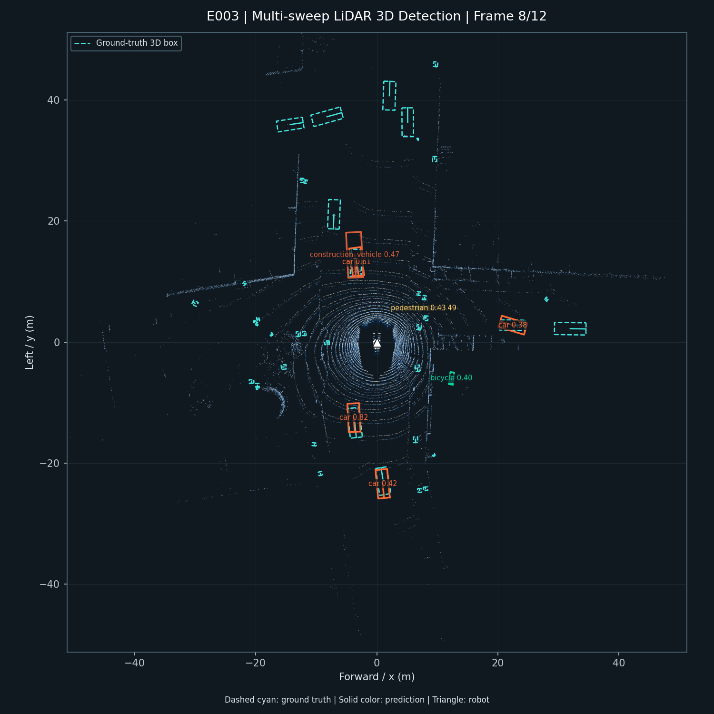

# 移动机器人激光雷达 3D 目标检测

基于 OpenPCDet、nuScenes 与 ROS 2 的移动机器人 LiDAR 3D 目标检测项目。项目在单张 RTX 4060 Laptop GPU（8GB）上完成了从多帧点云训练、官方评测、连续帧可视化，到 ROS 2 离线部署和自定义雷达数据接口的完整工程闭环。

> 数据集：nuScenes v1.0-mini。它用于验证工程方案和实验方向，不将 mini 指标与完整 nuScenes 榜单直接比较。

## 演示



浅色点为激光雷达点云，青色虚线框为数据集标注，彩色实线框为模型预测。白色三角形表示机器人位置与朝向；例如 `car 0.82` 表示预测类别为车辆、置信度为 0.82。

## 项目亮点

- **多帧时序融合**：将当前帧与两帧历史 LiDAR 点云按 ego pose 对齐，并引入时间差特征；在相同模型、数据划分和训练轮数下，mAP 从 `0.0931` 提升到 `0.1176`。
- **可视化演示**：对同一场景连续 12 帧执行推理，自动输出 BEV PNG、GIF 和帧级清单，直观展示点云、真实框、预测框、类别和置信度。
- **ROS 2 时序部署链路**：在 GPU 容器中构建 ROS 2 Humble 节点，完成 `PointCloud2 + PoseStamped -> 三帧对齐 -> PointPillars -> Detection3DArray` 离线回放；从第 3 帧起使用 E002 权重发布时序检测结果。
- **RViz 三维框展示**：将检测结果转换为 `MarkerArray`，以彩色 3D 框和类别置信度文字显示；G1 传感器仿真已完成 12 帧端到端验证。
- **真实数据接入接口**：定义 `Pedestrian / Cart / Pallet / Cone` 四类机器人目标的数据规范，提供原始 `.bin` 转换、3D 标注校验、数据划分检查和 OpenPCDet 索引生成工具。

## 实验结果

| 实验 | 点云输入 | mAP | NDS | 说明 |
| --- | --- | ---: | ---: | --- |
| E001 | 单帧，`MAX_SWEEPS=1` | 0.0931 | 0.1761 | PointPillars 基线 |
| E002 | 当前帧 + 2 历史帧，`MAX_SWEEPS=3` | **0.1176** | **0.1790** | 同配置下仅改变时序输入 |

主要类别的 E002 结果：`car AP 0.4582`、`pedestrian AP 0.5105`。行人 AP 相比单帧从 `0.3857` 提升到 `0.5105`。

## 系统结构

```text
nuScenes / 真实机器人 LiDAR
             |
             v
    点云预处理、格式转换与位姿发布
             |
             +--> OpenPCDet PointPillars 训练与评测
             |           |
             |           v
             |      BEV 连续帧可视化
             |
             +--> ROS 2 PointCloud2 + PoseStamped 回放
                         |
                         v
          单帧 / 三帧时序 PointPillars 节点
                         |
                         v
        vision_msgs / Detection3DArray
                         |
                         v
      visualization_msgs / MarkerArray -> RViz 3D 检测框
```

## 工程内容

```text
robot-3d-detection/
├── docker/       # CUDA 训练镜像与 ROS 2 Humble 推理镜像
├── scripts/      # 数据准备、训练、评测、可视化和数据校验脚本
├── ros2_ws/      # PointCloud2 回放节点与 PointPillars 检测节点
├── configs/      # nuScenes 与自定义机器人数据配置
├── docs/         # E001-E005 实验记录与数据规范
└── artifacts/    # README 展示用 BEV 检测图
```

## 快速复现

环境：Windows + WSL2 Ubuntu 22.04、Docker Desktop、NVIDIA GPU（训练与 ROS 2 推理）。OpenPCDet 源码和 nuScenes mini 数据集路径由各脚本的默认参数指定，也可以通过位置参数覆盖。

```bash
# 生成 E002 三帧模型的连续帧可视化
bash scripts/render_nuscenes_bev.sh

# 构建 ROS 2 Humble GPU 镜像
bash scripts/build_ros2_image.sh

# 回放 12 帧点云，并运行 ROS 2 检测节点
bash scripts/run_ros2_replay.sh

# 回放点云和激光雷达位姿，并运行 E002 三帧时序检测节点
bash scripts/run_ros2_temporal_replay.sh

# 在同一 ROS 2 网络中订阅 Unitree G1 的点云与里程计，运行 E002 时序检测
bash scripts/run_g1_temporal_detector.sh

# 模拟 G1 点云与里程计，并输出可在 RViz 显示的 3D 检测框
bash scripts/run_g1_sensor_sim.sh

# 校验真实机器人数据并生成 OpenPCDet 索引
bash scripts/prepare_robot_dataset.sh /path/to/project /path/to/custom-data
```

完整环境与实验入口见下方文档。真实数据与训练权重不提交到仓库。

## 文档索引

| 文档 | 内容 |
| --- | --- |
| [E001 基线结果](docs/05-e001-baseline-result.md) | 单帧训练与官方评测 |
| [E002 时序融合](docs/06-e002-temporal-experiment.md) | 三帧点云融合对照实验 |
| [E003 可视化](docs/07-e003-visualization.md) | BEV 图片与 GIF 生成 |
| [E004 ROS 2 部署](docs/08-e004-ros2-deployment.md) | 点云回放与 3D 检测节点 |
| [E005 自定义数据](docs/09-e005-custom-robot-data.md) | 真实雷达数据格式和校验 |
| [E006 时序 ROS 2](docs/11-e006-ros2-temporal-fusion.md) | 三帧缓存、位姿对齐与 E002 部署 |
| [Unitree G1 预部署](docs/12-unitree-g1-deployment.md) | 外接 GPU、话题映射与上机前检查 |
| [G1 现场接入清单](docs/13-g1-field-onboarding.md) | 自动话题探测、rosbag 采集与安全上机步骤 |
| [G1 传感器仿真](docs/14-g1-sensor-simulation.md) | 模拟 G1 点云和里程计，验证时序部署链路 |
| [E007 RViz 可视化](docs/15-e007-rviz-visualization.md) | 将 3D 检测结果转换为 RViz 彩色检测框 |
| [简历与面试表述](docs/10-resume-and-interview.md) | 可直接使用的项目描述 |

## 后续计划

1. 接入真实机器人 LiDAR 数据，完成小规模标注和微调。
2. 针对机器人类别接入自定义 mAP、延迟和稳定性评测。

## 致谢与许可

- 检测框架：[OpenPCDet](https://github.com/open-mmlab/OpenPCDet)，Apache-2.0。
- 数据集：[nuScenes](https://www.nuscenes.org/)，使用需遵循其单独的数据许可与使用条款。
- ROS 2 部署消息使用 `sensor_msgs/PointCloud2` 与 `vision_msgs/Detection3DArray`。
